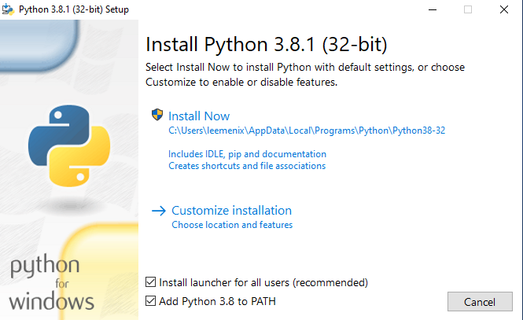

# Uvod u Python programski jezik

## Python 3

**Autor:** _Milenko Letic_

https://programiranje.ba


### Sadrzaj
=======

  * [Instalacija i podesavanje Python-a i PyCharm-a](#instalacija_i_podesavanje)


<a name="instalacija_i_podesavanje"/>
### Instalacija i podesavanje Python-a i PyCharm-a

https://python.org/downloads


Trenutna verzija Python-a, koju cemo ujedno obraditi prilikom ovog kursa je Python 3.

```TBD: par rijeci o Python 2```

### Python 3 instalacija

Korak 1.

Prilikom pokretanja instalacije, na prvom koraku je potrebno cekirati obe opcije:
* Install launcher for all users (recommended)
* Add Python 3.x to PATH




