# Uvod u Python programski jezik

**Autor:** _Milenko Letic_

https://programiranje.ba

_Ver._ **DRAFT**

<a name="intro"/>

### Uvod - par rijeci o programskom jeziku Python

Ovaj kurs ima za cilj da vas nauci osnove programiranja u programskom jeziku
Python 3. Nakon sto prijedjete kompletan kurs, trebali biste biti u mogucnosti
da samostalno kreirate programe i lako prijedjete na napredniji nivo
programiranja. Takodje, bicete u mogucnosti da prilagodite, prepravite Python
kod sa prethodne verzije Python 2 u Python 3 verziju.

Python je jedan od rijetkih programskih jezika, koji je u isto vrijeme
jednostavan i mocan. Nemojte se iznenaditi ako vam ucenje Python programskog
jezika ide veoma lako i brzo savladavate lekcije, jer to i jeste cilj Python-a
kao programskog jezika, da vam omoguci usmjeravanje paznje na rjesavanje
konkretnog problema i pronalaznje rjesenja, umjesto da morate voditi racuna o
sintaksi i strukturi programskog jezika kao sto je slucaj kod vecine ostalih
programskih jezika.

<a name="python-cinjenice"/>

#### Par cinjenica o Python-u:
* Jednostavan
* Lak za ucenje
* Besplatan i Otvorenog Koda
* Visi programski jezik
* Prilagodiv na razlicite platforme
* Interpretiran
* Objektno orjentisan
* Prosiriv
* TBD ...

<a name="python3-vs-python2"/>

#### Python 3 vs. Python 2

Portovanje Python 2 koda u Python 3

https://docs.python.org/3/howto/pyporting.html

<a name="prvi-koraci"/>

### Prvi koraci (DRAFT)

Postoje dva nacina koristenja Python-a kako biste pokrenuli vas kod (TBD:
program ili kod).
1. koristenjem interaktivnog interpreter komandnog prompta
1. koristenjem izvornog koda (source code)

#### Koristenjem interpreter prompt-a

Otvorite terminal na vasem operativnom sistemu (TBD: ovo je vec objasnjeno u
sekciji instalacija)
i pokrenite Python tako sto cete ukucati komandu **python3** i pritisnuti
**[Enter]**. Trebalo bi da dobijete Python interpreter prompt, koji izgleda
ovako

```python
Python 3.7.2 (default, Feb 23 2020, 18:31:07)
[GCC 5.5.0] on linux
Type "help", "copyright", "credits" or "license" for more information.
>>>
```

Odlicno, sada vec mozete da napisete vas prvi program u Python-u.
Nakon znaka **[>>>]** ukucajte:

```python
Python 3.7.2 (default, Feb 23 2020, 18:31:07)
[GCC 5.5.0] on linux
Type "help", "copyright", "credits" or "license" for more information.
>>> print("Zdravo Svijete!")
```

i pritisnite **[Enter]**. Trebalo bi dobijete ispisanu recenicu
**_Zdravo Svijete!_** u Python-u
interpreter prompt-u, nakon cega mozete nastaviti da koristite Python interpreter prompt.
```python
Python 3.7.2 (default, Feb 23 2020, 18:31:07)
[GCC 5.5.0] on linux
Type "help", "copyright", "credits" or "license" for more information.
>>> print("Zdravo Svijete!")
Zdravo Svijete!
>>>
```
##### Izlazak, napustanje Python interpreter prompt-a

Nakon sto ste testirali vas prvi Python kod, mozemo napustiti intrepreter sa nekom od sledece tri
komande:

```python
exit()
```
```python
quit()
```
```python
Kombinacija tastera [Crtl] i tastera [D]
```
#### Koristenjem izvornog koda

Kreiramo novi fajl **kod-201-zdravo-svijete.py** i upisemo sledeci sadrzaj
```python
print("Zdravo Svijete!")
```

Sacuvamo fajl **kod-201-zdravo-svijete.py** na zeljenu lokaciju i isti zatvorimo. Sada je
potrebno otvoriti terminal na vasem operativnom sistemu, pozicionirati se u direktorij gdje
ste sacuvali kod i izvrsiti komandu
```shell script
python kod-201-zdravo-svijete.py
```
Trebalo bi da dobijete povratnu poruku na ekranu
```shell script
Zdravo Svijete!
```

Odlicno, sada kada poznajemo na koje nacine mozemo pokrenuti Python program, vrijeme je da
prijedjemo na zanimljivije stvari koje mozemo uraditi sa Python-om. Slozicete se da je
ispisivanje rijeci "Zdravo Svijete!" malo dosadno.

<a name="osnove-zadaci-za-vjezbu"/>

### Osnove zadaci za vjezbanje

<a name="kod-201-zdravo-svijete.py"/>

Napisati program koji nakon izvrsavanja ispisuje

```
Ovo je moj prvi program.
```

Rjesenje: 

**`kod-201-zdravo-svijete.py`**

```python
print("Ovo je moj prvi program.") 
```

<a name="kod-202-zdravo-svijete.py"/>
Napisati program koji nakon izvrsavanja ispisuje

```
Zdravo
Svijete
!
```
Rjesenje:

**`kod-202-zdravo-svijete.py`**

```python
print("Zdravo")
print("Svijete")
print("!")
```

<a name="osnove"/>

### Osnove

U ovoj sekciji cemo nauciti kako dinamicno unositi, manipulisati i ispisivati
sadrzaj u Python-u.
Ovo cemo postici koristeci konstante i varijable, ali cemo i nauciti osnovne
koncepte Python-a.

<a name="komentari"/>

#### Komentari

_Komentari_ predstavljaju bilo koji skup karakter koji se nalaze iza znaka `#`
i veoma su korisni prilikom pisanje koda. Zamislite da pisete program od 300
linija koda i nakon par godina se vratite  da uradite sitne izmjene u programu
ili da neko drugi odluci odrzavati vas program. Ako nemate dobru dokumentaciju,
moracete sve proci iz pocetka, sto ce vam u najmanju ruku uzeti vrijeme ali
cete izgledati ne profesionalno.
Zato je zlatno pravilo programiranja, kada god je to potrebno (ovo cete nauciti iskustvom) pisite komentare!

**`Primjer`**
```python
print('Zdravo Svijete!') # sve poslije znaka '#' je komentar
```

ili
```python
# sve poslije znaka '#' je komentar
print('Zdravo Svijete!')
```

Kada koristimo komentare:
* objasnjenje predpostavki
* objasnjenje vaznih odluka unutar programa
* objasnjenje vaznih detalja
* objasnjenje problema koji rjesavamo
* objasnjenje samog programa

Postoji pravilo koje kaze:

**`Kod vam kaze kako, komentai bi trebali reci zasto.`**

<a name="Konstante"/>

#### Konstante

Primjer _konstanti_ su brojevi kao 1, 10, 23.3, rijeci 'Zdravo svijete' ili
kombinacija karaktera 'Zdravo svijete!'.
Zovemo ih konstante jer koristimo njihovu vrijednost u programu onakvim kakva
je zadata. Vrijednost broja 2 predstavlja samog sebe i ne moze biti
promijenjena.

<a name="brojevi"/>

#### Brojevi

_Brojevi_ su podijeljeni u dva tipa 
* cjelobrojni (integer)
* brojevi sa pokretnim zarezom (float)

**`Primjer: cjelobrojni brojevi`**
```python
1
23
49
200
```

**`Primjer: brojevi sa pokretnim zarezom`**
```python
3.14
32.23241
25.4E-3 (E predstavlja vrijednost na 10-tu) -> 25.4 * 10^-3^
```

<a name="stringovi"/>

#### Stringovi

_Stringovi_ predstavljaju niz karaktera. Jos jednostavnije vise rijeci
predstavlja string. Kako su stringovi sveprisutni kroz cijeli kurs Python
programiranje, bitno je da dobro razumijete ovo poglavlje.

##### Stringovi izmedju apostrofa

Mozemo koristiti apostrofe _' '_ da bismo formirali string.

**`Primjer`**
```python
'Ovo je string.'
```

##### Stringovi izmedju navodnika

Isto tako mozemo koristiti navodnike _" "_ da bismo formirali string.

**`Primjer`**
```python
"Ovo je string."
```

Sigurno se pitate, pa u cemu je razlika izmedju apostrofa i navodnika? Hajde da
jednostavno kazemo da nema razlike, mozete koristiti i jednu i drugu opciju,
ali prakticna primjena je u slucaju kada trebate ispisati jedan od ova dva
znaka unutar stringa.

**`Primjer`**
```python
"Ovo je string. Koji sadrzi rijec 'Nova Godina' unutar apostrofa"
```

Uvijek morate voditi racuna da imate otvorene i zatvorene znakove apostrofa ili navodnika
prilikom pisanja koda.

##### Stringovi izmedju trostrukih apostrofa ili navodnika

U slucaju da zelite viselinijski string tada je potrebno koristiti trostruke apostrofe
_''' '''_ ili navodnike _""" """_. U ovom slucaju mozete koristiti proizvoljan broj
apostrofa ili navodnika unutar stringa.

**`Primjer`**
```python
'''
Ovo je multilinijski string.
Koji sadrzi rijec 'Nova Godina' unutar apostrofa
ali i rijec "Stara Godina" unutar navodnika
'''
```

_Stringovi_ su nepromjenjivi, sto znaci jednom kad ih kreirate, vise ih ne mozete promijeniti. Iako ovo zvuci kao losa ideja, zaista nije. Kasnije cemo vidjeti kako
ovo ne predstavlja nikakvo ogranicenje prilikom programiranja.

##### Metod 'format'

Ponekad zelimo kreirati string iz razlicitih izvora. Ovde nam u pomoc uskace metod
_format_.

<a name="kod-205-metod-format.py"/>

**`Primjer: kod-205-metod-format.py`**
```python
godine = 30
ime = 'Petar'

print('{0} ima {1} godina.'.format(ime, godine))
print('Da li {0} ide u skolu?'.format(ime))
```
**`Rezultat`**
```
Petar ima 30 godina.
Da li Petar ide u skolu?
```

##### Objasnjenje

Ocigledno string moze koristiti odredjene specifikacjije, a metod _format_ moze
biti pozvan upravo da zamijeni ove specifikacije odredjenim argumentima.

Primijetimo da unutar string-a koristimo _{0}_ koji odgovara vrijednosti
promjenjive _ime_ koja je ujedno prvi argument metode _format_. Slicno _{1}_
odgovara vrijednosti promjernjive _godine_ koja je drugi argument metode
_format_.

Bitno je napomenuti da Python pocinje brojati od _0_ (nule) sto znaci da prva
pozicija predstavlja _indeks 0_, druga pozicija _indeks 1_ itd.

**`Primjer`**
```python
Brojevi:  0   1   2   3   4   5   6   7   8   9   10  100  201  300  [n]

Indeks:  [0] [1] [2] [3] [4] [5] [6] [7] [8] [9] [10] [11] [12] [13] [n]
```

Prethodni string mozemo napisati i kao

```python
print(ime + ' ima ' + str(godine) + ' godina.')
```

ciji ce rezultat biti identican

```python
Petar ima 30 godina.
```

ali primijticete da ovaj nacin pisanja izgeda dosta ruznije i povecava
mogucnost greske. Takodje metod _format_ ce automatski izvrsiti konverziju
varijable _godine_ u tip string, ali dodatno mozemo izmijeniti poruku bez
izmejne vrijednosti varijable. TBD.

Takodje, koristenjem metode _format_ numerisanje unutar same poruke je opcionalno, tako
da kod moze biti napisan i kao

<a name="kod-207-metod-format.py"/>

**`Primjer: kod-207-metod-format.py`**
```python
godine = 30
ime = 'Petar'

print('{} ima {} godina.'.format(ime, godine))
print('Da li {} ide u skolu?'.format(ime))
```
**`Rezultat`**
```
Petar ima 30 godina.
Da li Petar ide u skolu?
```

Isti kod moze biti napisan i na nacin da imenujemo parametre

<a name="kod-208-metod-format.py"/>

**`Primjer: kod-208-metod-format.py`**
```python
godine = 30
ime = 'Petar'

print('{ime_osobe} ima {godine_osobe} godina.'.format(ime_osobe=ime, godine_osobe=godine))
print('Da li {ime_osobe} ide u skolu?'.format(ime_osobe=ime))
```
**`Rezultat`**
```
Petar ima 30 godina.
Da li Petar ide u skolu?
```

Sa verzijom Python 3.6 uvodi novi nacin kako mozemo imenovati parametre, skracenom
verzijom "f-strings"

<a name="kod-209-metod-format.py"/>

**`Primjer: kod-209-metod-format.py`**
```python
godine = 30
ime = 'Petar'

print(f'{ime} ima {godine} godina.') # Primijetimo 'f' prije definisanja stringa
print(f'Da li {ime} ide u skolu?') # Primijetimo 'f' prije definisanja stringa
```
**`Rezultat`**
```
Petar ima 30 godina.
Da li Petar ide u skolu?
```

<a name="varijable"/>

### Varijable (DRAFT)
Kada radimo sa podacima, potrebno ih je organizovati, kontejneri kutije u koje stavlljamo pohranjujemo nase podatke predstavljaju varijable. Sta predstavljaju , zasto su korisne, koje sve vrste (tipove) podataka mozemo smjestiti u varijable.

bitno je napomenuti vaznost uvlacenja linija
<a name="kod-301-varijable.py"/>

**`kod-301-varijable.py`**

```python
print("Bila mama Kukunka, Kukunka")
print("Bio tata Taranta, Taranta")
print("imali su maloga Ju-Ju")

print("Jednom su se setali, setali")
print("kraj duboke rijeke Nil, rijeke Nil")
print("gdje je bio velik krokodil")
```

**`Rezultat`**
```
Bila mama Kukunka, Kukunka
Bio tata Taranta, Taranta
imali su maloga Ju-Ju
Jednom su se setali, setali
kraj duboke rijeke Nil, rijeke Nil
gdje je bio velik krokodil
```

<a name="kod-302-varijable.py"/>

**`kod-302-varijable.py`**

```python
mama_ime="Kukunka"
tata_ime="Taranta"
beba_ime="Ju-Ju"
rijeka_naziv="Dunav"

print("Bila mama " + mama_ime + ", " + mama_ime)
print("Bio tata " + tata_ime + ", " + tata_ime)
print("imali su maloga " + beba_ime)

print("Jednom su se setali, setali")
print("kraj duboke rijeke " + rijeka_naziv + ", rijeke " + rijeka_naziv)
print("gdje je bio velik krokodil")
```

**`Rezultat`**
```
Bila mama Kukunka, Kukunka
Bio tata Taranta, Taranta
imali su maloga Ju-Ju
Jednom su se setali, setali
kraj duboke rijeke Dunav, rijeke Dunav
gdje je bio velik krokodil
```

<a name="osnovne-matematicke-operacije"/>

### Osnovne matematicke operacije

#### Cetiri osnovne matematicke operacije
Cetiri osnovne matematicke operacije predstavljaju
1. ( + ) sabiranje 
1. ( - ) oduzimanje
1. ( * ) mnozenje  
1. ( / ) dijeljenje


<a name="kod-501-osnovne-matematicke-operacije.py"/>

**`kod-501-osnovne-matematicke-operacije.py`**
```python
print( 3+2 )
print( 3-2 )
print( 3*2 )
print( 3/2 )
```

**`Rezultat`**
```
5
1
6
1.5
```

<a name="napredne-matematicke-operacije"/>

### Napredne matematicke operacije
Ako damo sebi za pravo da ostale matematicke operacije, osim osnovnih
nazovemo napredne matematicke operacije imamo sledece primjere u Python-u.

#### Modulo operator ( % )
Modulo operator uzima broj koji se nalazi na lijevoj strani i dijeli ga 
brojem koji se nalazi na desnoj strani, a zatim kao rezultat vraca cjelobrojni
ostatak prilikom ovog dijeljenja.

<a name="kod-503-modulo.py"/>

**`kod-503-modulo.py`**

```python
print( 10%3 )
```

**`Rezultat`**
```
1
```

<a name="napredne-matematicke-operacije-2"/>

Pored navedenih primjera, potrebno je napomenuti da Python raspolaze
sa ogromnom bazom naprednih matematickih operacija koje na jednostavan 
nacin rjesavaju kompleksne probleme.

<a name="kod-505-napredne-matematicke-operacije-primjeri.py"/>

**`kod-505-napredne-matematicke-operacije-primjeri.py`**
```python
print( 4 * 3 )
print( 2 * 4 )
print( 20 % 3 )
print( 3 + 3 * 3)
print( 10 / 5.0 )

broj = 20
broj += 100
print( broj )
```

**`Rezultat`**
```
12
8
2
12
2.0
120
```

<a name="kod-506-math-modul.py"/>

**`kod-506-math-modul.py`**

```python
import math

print( pow(3,2) )
print( math.sqrt(9) )
print( round(4.335) )
```

**`Rezultat`**
```
9
3.0
4
```

<a name="unos-podataka-od-strane-korisnika"/>

Pored navedenih primjera, potrebno je napomenuti da Python raspolaze
sa ogromnom bazom naprednih matematickih operacija koje na jednostavan 
nacin rjesavaju kompleksne probleme.


<a name="kod-601-interakcija-sa-korisnikom.py"/>

**`kod-601-interakcija-sa-korisnikom.py`**
```python
trenutna_godina = 2020
ime = input("Unesite ime: ")
prezime = input("Unesite prezime: ")
godina_rodjenja = int(input("Unesite godinu rodjenja: "))

print("Dobrodosli, " + ime + " " + prezime)
print("Trenutno imate " + str(2020 - godina_rodjenja) + " godina")
print("Hvala sto ste koristili ovaj program")
```

**`Rezultat`**
```
Unesite ime: Miladin
Unesite prezime: Sobic
Unesite godinu rodjenja: 1956
Dobrodosli, Miladin Sobic
Trenutno imate 64 godina
Hvala sto ste koristili ovaj program
```

<a name="operatori-i-izrazi"/>

### Operatori i izrazi
<a name="kontrola-toka"/>

### Kontrola toka (DRAFT)

Do sad smo nase programe izvrsavali kao niz komandi od vrha ka dnu, uvijek tim redoslijedom. Sta u slucaju da zelimo promijeniti tok izvrsavanja programa? Sta
ako zelimo da se nas program ponasa drugacije u zavisnosti od situacije u kojoj
se nalazi? Recimo da ispise `Dobro jutro` ili `Dobro vece` u zavisnosti od doba 
dana? 

Ovo mozemo postici koristenjem izraza za kontrolu toka. U Python-u imamo tri izraza
za kontrolu toka i to:
1. if
1. for
1. while

<a name="if-komanda"/>

#### `if` komanda (DRAFT)

Izraz `if` se koristi za provjeru uslova: `if` ako je izraz tacan `true`, onda izvrsi
blok naredbi (tzv. `if-block`, `else` u suprotnom izvrsi drugi blok naredbi (tzv. `else-block`). Bitno je napomenuti da je `else-block` opcionalan. 

<a name="kod-802-if-elif-else-iskaz.py"/>

**`Primjer: kod-802-if-elif-else-iskaz.py`**
```python
broj = 32
pokusaj = int(input('Unesite cijeli broj: '))

if pokusaj == broj:
	# prvi blok izraza pocinje ovde
	print('Cestitamo, pogodili ste broj.')
	print('Pocastite se kafom ;)')
	# prvi blok izraza zavrsava ovde

elif pokusaj < broj:
	# drugi blok izraza pocinje ovde
	print('Nazalost niste pogodili.')
	print('Hint: Trazeni broj je veci od unesenog ;)')
	print('Pokusajte ponovo.')
	# drugi blok izraza zavrsava ovde

else:
	# treci i finalni blok izraza pocinje ovde
	print('Nazalost niste pogodili.')
	print('Hint: Trazeni broj je manji od unesenog ;)')
	print('Pokusajte ponovo.')
	# treci i finalni blok izraza zavrsava ovde

print('Kraj!')
# Zadnji izraz ce uvijek biti izvrsen
# naravno nakon sto je ispunjen jedan od gore navedenih uslova
```

**`Rezultat:`**
```
$ python kod-802-if-elif-else-iskaz.py
Unesite cijeli broj: 3
Nazalost niste pogodili.
Hint: Trazeni broj je veci od unesenog ;)
Pokusajte ponovo.
Kraj!

$ python kod-802-if-elif-else-iskaz.py 
Unesite cijeli broj: 44
Nazalost niste pogodili.
Hint: Trazeni broj je manji od unesenog ;)
Pokusajte ponovo.
Kraj!

$ python kod-802-if-elif-else-iskaz.py
Unesite cijeli broj: 32
Cestitamo, pogodili ste broj.
Pocastite se kafom ;)
Kraj!
```

<a name="while-naredba"/>

#### `while` naredba (DRAFT)

Naredba `while` nam sluzi kada zelimo da izvrsavamo blok koda sve dok je uslov ispunjen, odnosno tacan. Naredba `while` je primjer onoga sto nazivamo `petlja` u programiranju.
Naredba `while` moze imati opcionu `else` klauzulu.

<a name="kod-804-while-naredba.py"/>

**`Primjer: kod-804-while-naredba.py`**
```python
broj = 32
petlja = True

while petlja:
	
	pokusaj = int(input('Unesite cijeli broj: '))

	if pokusaj == broj:
		# prvi blok izraza pocinje ovde
		print('Cestitamo, pogodili ste broj.')
		print('Pocastite se kafom ;)')
		# u slucaju da je broj pogodjen postavi vrijednost
 		# varijable petlja na False  
		petlja = False 
		# prvi blok izraza zavrsava ovde
	elif pokusaj < broj:
		# drugi blok izraza pocinje ovde
		print('Nazalost niste pogodili.')
		print('Hint: Trazeni broj je veci od unesenog ;)')
		print('Pokusajte ponovo.')
		# drugi blok izraza zavrsava ovde
    else:
		# treci i finalni blok izraza pocinje ovde
		print('Nazalost niste pogodili.')
		print('Hint: Trazeni broj je manji od unesenog ;)')
		print('Pokusajte ponovo.')
		# treci i finalni blok izraza zavrsava ovde
else:
	print('Kraj while petlje.')


print('Kraj!')
```

**`Rezultat:`**
```
$ python kod-804-while-naredba.py 
Unesite cijeli broj: 43
Nazalost niste pogodili.
Hint: Trazeni broj je manji od unesenog ;)
Pokusajte ponovo.

Unesite cijeli broj: 31
Nazalost niste pogodili.
Hint: Trazeni broj je veci od unesenog ;)
Pokusajte ponovo.

Unesite cijeli broj: 32
Cestitamo, pogodili ste broj.
Pocastite se kafom ;)

Kraj while petlje
Kraj
```
<a name="for-petlja"/>

#### `for` petlja (DRAFT)

_for..in_ je jos jedan primjer petlje koja prolazi kroz prolazi kroz sekvencu (niz) (TBD) 
objekata. Iako ce kasnije biti rijeci o sekvencama, za sad je bitno da znate da 
sekvence predstaljaju kolekciju stavki u odredjenom rasporedu.

<a name="kod-806-for-petlja.py"/>

**`Primjer: kod-806-for-petlja.py`**
```python
for broj in range(10, 15):
	print(broj)
```

**`Rezultat:`**
```
$ python kod-806-for-petlja.py
10
11
12
13
14
Kraj for petlje!
```

<a name="funkcije"/>

### Funkcije (DRAFT)

Funkcije predstavljaju dio koda koji moze da se jednom napise a koristi vise puta. 
Nakon sto damo ime funkciji, ono ustvari predstavlja skup izjava, koje kasnije pozivamo
bilo gdje u kodu, sto je i poznato kao pozivanje funkcije (calling the function).

Bitno je napomenuti da je koncept funkcija veoma vazan kada se radi o iole kompleksnom
programu, sto vazi za bilo koji programski jezik, tako da je veoma bitno da ovo poglavlje
shvatite ozbiljno i ako je potrebno prodjete vise puta.

Funkcije u Python-u su definisane kljucnom rijeci `def`, nakon koje slijedi identifikator
ili ime funkcije `def ime_funkcije`, pracen otvorenom i zatvorenom zagradom `def ime_funkcije()` unutar kojih se opcionalno mogu naci parameteri/varijable i konacno se prva linija funkcije zavrsava dvotackom 'def ime_funkcije():'. Nakon ovoga slijedi
blok izraza koji pripadaju ovoj funkciji. 

Primjer funkcije `Zdravo Svijete!`

<a name="kod-901-funkcija-zdravo-svijete.py"/>

**`Primjer: kod-901-funkcija-zdravo-svijete.py`**
```python
def zdravo_svijete():
  # ovaj blok pripada funkciji
  print("Zdravo Svijete!")
# kraj funkcije

zdravo_svijete() # pozivamo funkciju zdravo_sviete
zdravo_svijete() # pozivamo funkciju zdravo_svijete drugi put
```
**`Rezultat`**
```
Zdravo Svijete!
Zdravo Svijete!
```

#### Komentar na prethodnu funkciju
Definisali smo funkciju `zdravo_svijete` prema prethodno objasnjenoj sintaksi. Ovo je 
jednostavna funkcija, bez parametara, sto mozemo vidjeti prema praznim zagradama 
funkcije, ali je dovoljna da prikaze nacin kreiranja i upotrebe funkcija u Python-u.

Parametri funkcije ce biti objasnjeni i prakticno pokazani u sledecoj sekciji. Trenutno 
je vazno zapamtiti da parametri funkcije predstavljaju ulaz podataka za funkciju i mogu
biti proslijedjeni u razlicitim vrijednostima i tipovima cime dobijamo odredjen izlaz ili
rezultat koji nam daje funkcija.

Bitno je primjetiti da pozivajuci funkciju `zdravo_svijete` dobijamo ispis teksta `Zdravo Svijete!` bez da moramo citav kod pisati ponovo.

<a name="kod-906-funkcija-sa-parametrima.py"/>

**`kod-906-funkcija-sa-parametrima.py`**
```python
def uporedi(a,b):
  if a > b:
    print(a, 'je vece od', b)
  elif a == b:
    print(a, 'je jednako', b)
  else:
    print(a, 'je manje od', b)

# direktno prosljedivnje parametara funkciji
uporedi(3,5)
uporedi(5,5)
uporedi(6,2)
```
**`Rezultat`**
```
(3, 'je manje od', 5)
(5, 'je jednako', 5)
(6, 'je vece od', 2)
```
<a name="moduli"/>

### Moduli

<a name="tipovi-podataka"/>

### Tipovi podataka
<a name="strukture-podataka"/>

### Strukture podataka (DRAFT)

Strukture podataka u Python-u predstavljaju upravo to, strukture kao nosioce
podataka zajedno.

Postoje cetiri ugradjene (built-in) strukture u Python-u i to:
1. List (Liste)
1. Tuple (Tuple :)
1. Dictionary (Rijecnici)
1. Set (Setovi)

<a name="rjesavanje-problema"/>

### Rjesavanje problema


<a name="objektno-orjentisano-programiranje"/>

### Objektno orijentisano programiranje


<a name="izuzeci"/>

### Exceptions (Izuzeci?) (DRAFT)

Exception (Izuzeci) se pojavljuju kada se desi neka posebna situacija prilikom izvrsenja
programa. Recimo program pokusava da cita fajl na disku, ali fajl ne postoji ili je pod
drugim imenom? 
Slicno, sta ako u programu postoji neka sintaksna greska? Python ce nas upozoriti i 
dobicemo poruku o gresci (error).

### Greske

Uzmimo za primjer funkciju `print`. Sta ce se desiti ako umjesto `print` pozovemo `Print`?
Primijeticete da smo u ovom slucaju koristili prvo veliko slovo, sto nikako nije ispravno.
U ovom slucaju, Python ce nas upozoriti i dobicemo poruku o gresci.


<a name="hvatanje-greske"/>

### Hvatanje greske (exception)

Uzmimo za primjer funkciju `print`. Sta ce se desiti ako umjesto `print` pozovemo `Print`?
Primijeticete da smo u ovom slucaju koristili prvo veliko slovo, sto nikako nije ispravno.
U ovom slucaju, Python ce nas upozoriti i dobicemo poruku o gresci.

<a name="kod-1502-greska-print.py"/>

**`kod-1502-greska-print.py`**
```python
Print("Da li je ovo bilo ispravno?")
```

**`Rezultat`**
```
$ python kod-1502-greska-print.py
Traceback (most recent call last):
  File "kod.py", line 1, in <module>
    Print("Da li je ovo bilo ispravno?")
NameError: name 'Print' is not defined
```

<a name="standardne-bibliotke"/>

### Standardne biblioteke


<a name="tips-and-tricks"/>

### Tips and tricks


<a name="dalji-koraci"/>

### Dalji koraci


<a name="korisni-linkovi"/>

### Korisni linkovi


<a name="feedback"/>

### Feedback

<a name="instalacija"/>

### Instalacija i podesavanje Python-a i PyCharm-a

https://python.org/downloads

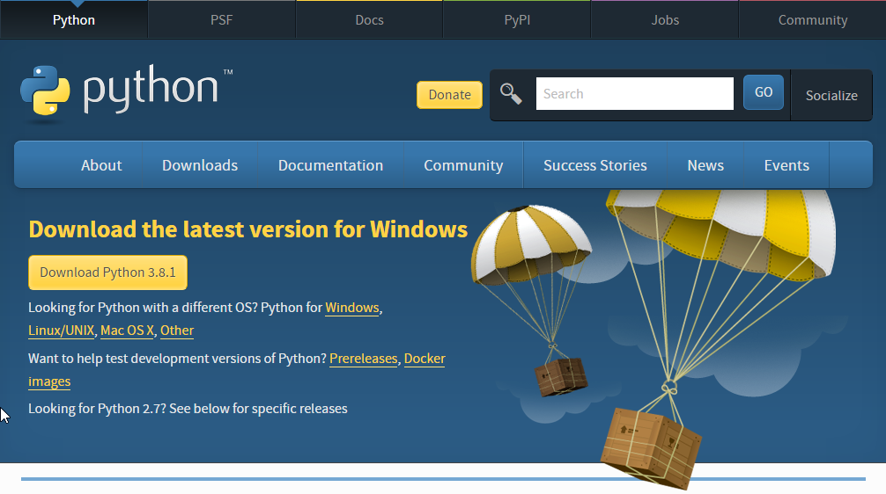

Trenutna verzija Python-a, koju cemo ujedno obraditi prilikom ovog kursa je Python 3.

```TBD: par rijeci o Python 2```

<a name="python-instalacija"/>

#### Python 3 instalacija

##### Korak 1.

Prilikom pokretanja instalacije, na prvom koraku je potrebno cekirati obe opcije:
* Install launcher for all users (recommended)
* Add Python 3.x to PATH

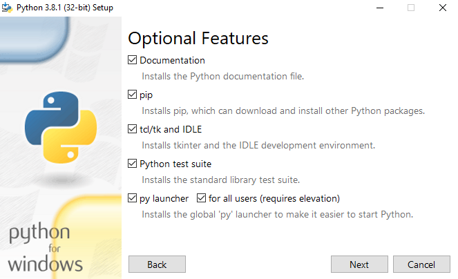

##### Korak 2. 

Na drugom koraku je potrebno jos jednom cekirati opciju:
* for all users (requires elevation)


#### Korak 3.

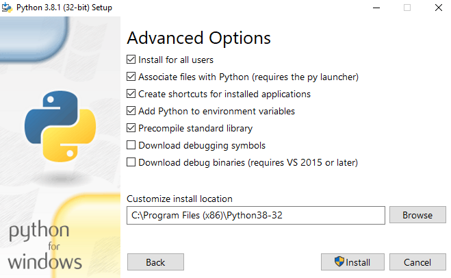

#### Korak 4. 
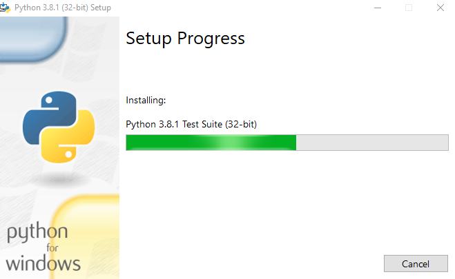

#### Korak 5. 
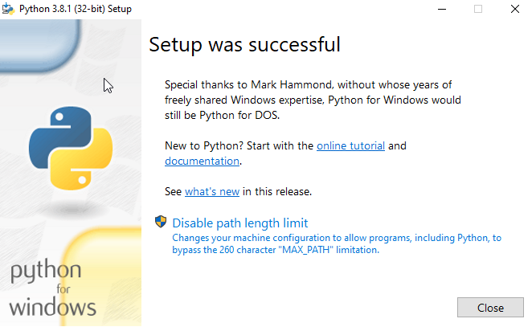

#### Korak 6. 
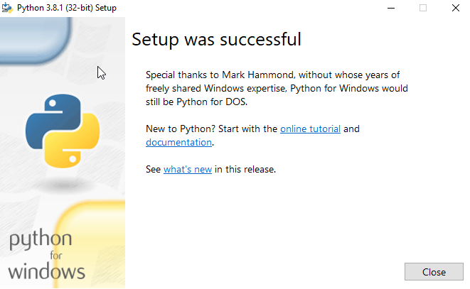


<a name="pycharm-instalacija"/>

#### PyCharm instalacija

https://jetbrains.com/pycharm/download

##### Korak 1. 
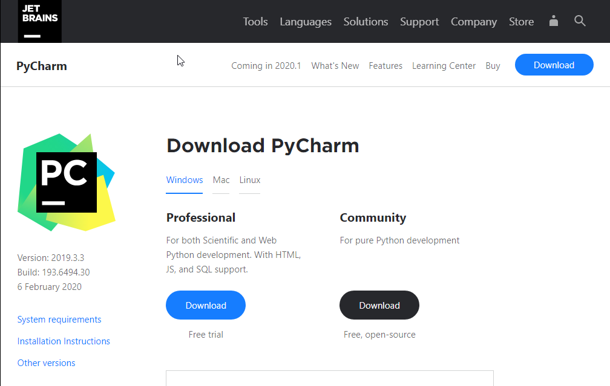

##### Korak 2. 
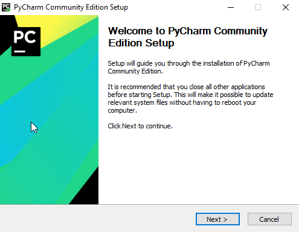


##### Korak 3. 
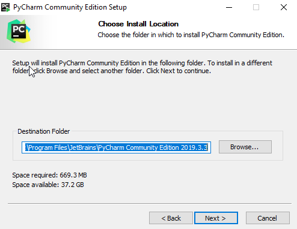

##### Korak 4. 
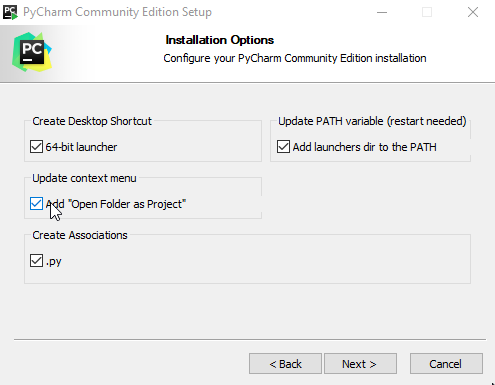

##### Korak 5. 


##### Korak 6. 


<a name="pycharm_podesavanje"/>

#### PyCharm podesavanje parametara

Nakon restarta pokrenemo PyCharm i konfigurisemo minimalna podesavanja

##### Korak 1.
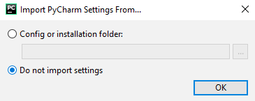

##### Korak 2.
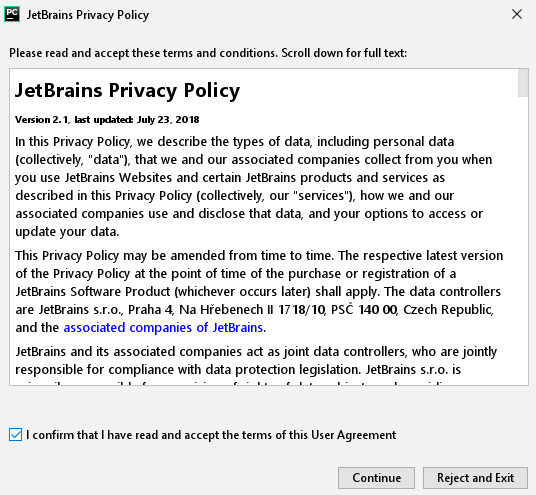

##### Korak 3.
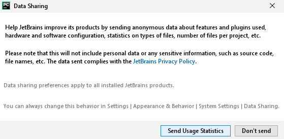

##### Korak 4.
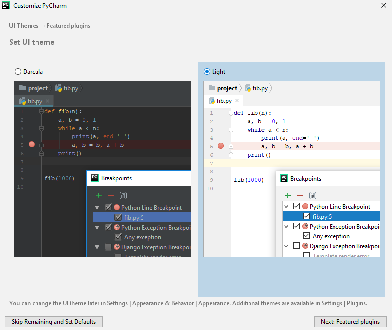

##### Korak 5.

Kliknite na Project interpreter i podesite Base interpreter 
[vrijednost moze varirati u zavisnosti od vaseg OS-a]

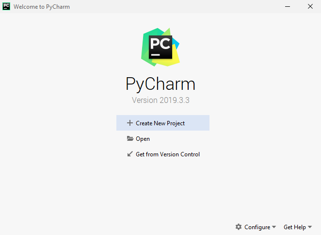

##### Korak 6.
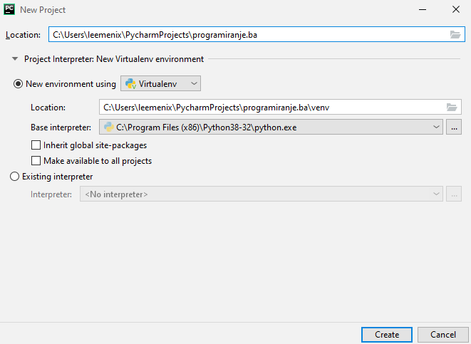

##### Korak 7.
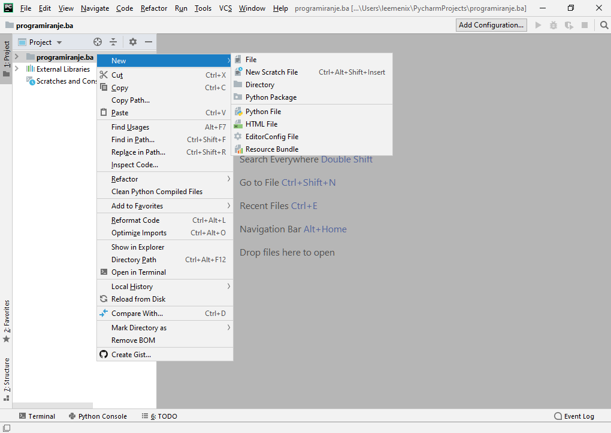

##### Korak 8.
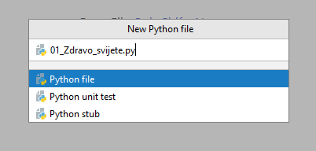

##### Korak 9.
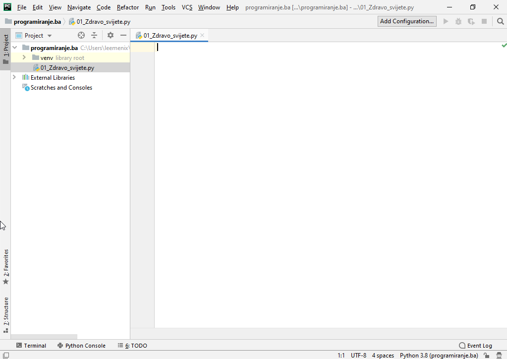

##### Korak 10.
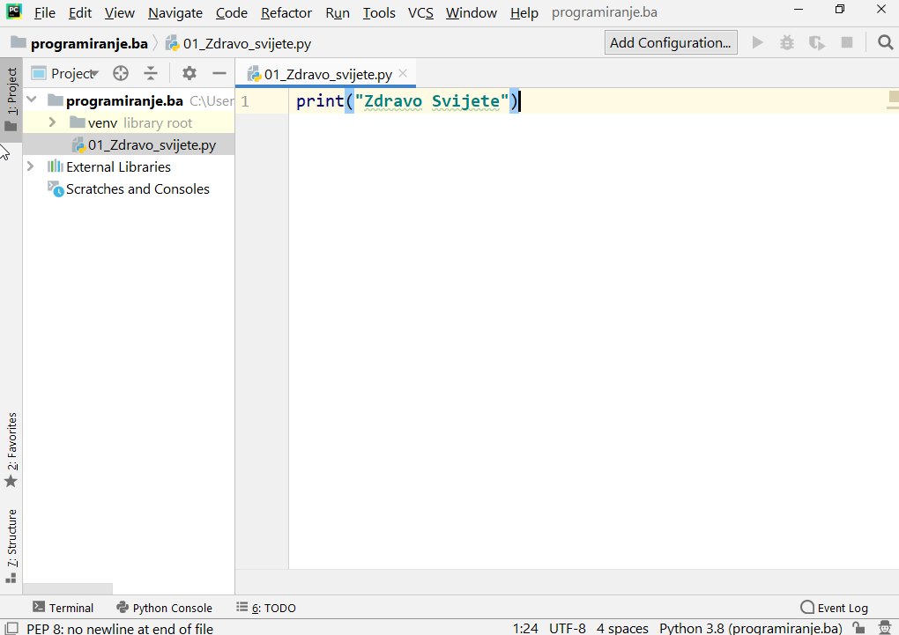

##### Korak 11.
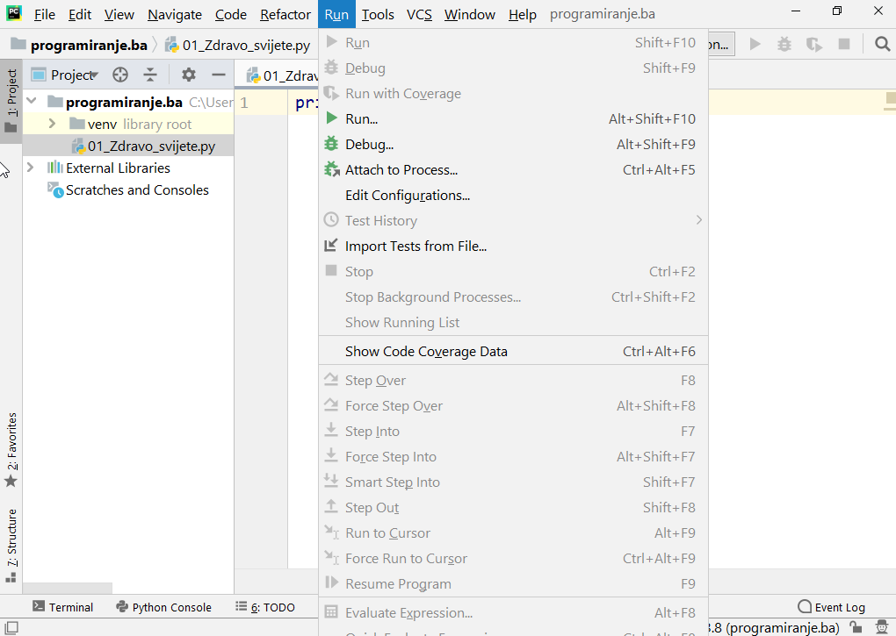

##### Korak 12.
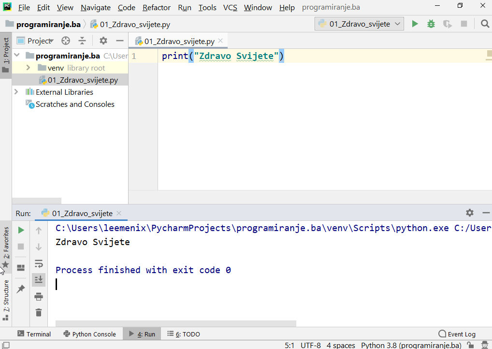


### Sadrzaj
=======

  * [Uvod - par rijeci o programskom jeziku Python](#intro)
    * [Par cinjenica o Python-u](#python-cinjenice)
    * [Python 3 vs. Python 2](#python3-vs-python2)

  * [Instalacija](#instalacija)
    * [Python 3 instalacija](#python-instalacija)
    * [IDE - PyCharm instalacija](#pycharm-instalacija)
      * [PyCharm podesavanje parametara](#pycharm-podesavanje)
    
  * [Osnove](#osnove)
    * [program-01 - zdravo_svijete.py](#zdravo-svijete)
  
  * [Operatori i izrazi](#operatori-i-izrazi)
  
  * [Kontrola toka](#kontrola-toka)
  
  * [Funkcije](#funkcije)
  
  * [Moduli](#moduli)
  
  * [Tipovi podataka](#tipovi-podataka)
  
  * [Varijable](#varijable)
    * [program-02 - varijable-01.py](#varijable-01)
    * [program-03 - varijable-02.py](#varijable-02)
  
  * [Stringovi](#stringovi)
  
  * [Matematicke operacije](#matematicke-operacije)

  * [Strukture podataka](#strukture-podataka)

  * [Rjesavanje problema](#rjesavanje-problema)

  * [Objektno orijentisano programiranje](#objektno-orjentisano-programiranje)

  * [Ulaz/Izlaz](#ulaz-izlaz)

  * [Exceptions (Izuzeci?)](#izuzeci)

  * [Standardne biblioteke](#standardne-bibliotke)

  * [Tips and tricks](#tips-tricks)

  * [Daljnji koraci](#daljnji-koraci)

  * [Korisni linkovi](#korisni-linkovi)

  * [Feedback](#feedback)


<a name="ulaz-izlaz"/>

### Ulaz/Izlaz

U situaciji kada je potrebno vrsiti interakciju sa korisnikom, ali i u
situaciji kada je potrebno vrsiti upis i ispis u i iz fajlova.


<a name="ulaz"/>

### program-xx - ulaz.py

```python
def reverzni_zapis(unos):
    return unos[::-1]

def je_li_palindrom(unos):
    return unos == reverzni_zapis(unos)

upis = input("Unesi tekst: ")

if je_li_palindrom(upis):
    print("Da, unijeti tekst je palindrom")
else:
    print("Ne, unijeti tekst nije palindrom")
```

Output 1:
```
Unesi tekst: _*neki tekst_
Ne, unijeti tekst nije palindrom
```

Output 2:
```
Unesi tekst: anavolimilovana
Da, unijeti tekst je palindrom
```


### Organizacija podataka

### List

List funkcije

Tuples

Dictionaries


Funkcije i uslovi
Return statement

Prijedlozi koje tekst editore koristiti (Sublime, MS Code ...)

Naglasiti vaznost engleskog jezika, kao i to da neki nazivi jednostavno
ne mogu bit prevedeni

The Software Development Process

We have now gone through the various phases in the process of writing a software. These phases can be summarised as follows:

    What (Analysis)
    How (Design)
    Do It (Implementation)
    Test (Testing and Debugging)
    Use (Operation or Deployment)
    Maintain (Refinement)

Show Kanban and Scrum#### Pravila pisanja

* Prva i zadnja linija fajla mora biti prazna
* Za naslove koristimo tri tarabe "###"
