

## Priprema radnog okruzenja

### Izbor editora teksta i **Integrisanog razvojnog okruzenja** IDE (Integrated Development Environment)

#### Izbor tekst editora

Za pocetnike, se preporucuje koristenje nekog jednostavnog tekst editora kao Notpad++, Sublime, VisualStudio Code ...

#### Izbor Interisanog razvojnog okruzenja

Vecina programera odabere pisanje Python koda, koristenjem specijalnog 
integrisanog razvojnog okruzenja. Trenutno tri najistaknutija za Python su 
Eclipse, PyCharm i Netbeans. Za potrebe kursa, koristicemo **PyCharm**.

#### Instalacija Windows

##### Korak 1.

Nakon sto otvoritmo stranicu https://python.org potrebno je da skinemo 
instalacijski paket za trenutnu aktuelnu verziju Python-a.

Za vrijeme pisanje kursa verzija Python-a je bila 3.8.2, sto se moze 
razlikovati u vasem slucaju ali princip instalacije je isti ili slican.

Iz padajuceg menija "Downloads" potrebno je izabrati opciju "Windows"

##### Korak 2.

Na sledecoj stranici je potrebno kliknuti na 
**"Latest Python 3 Release - Python 3.8.2"**

##### Korak 3.

Sada je potrebno skrolati do dna stranice

sve dok ne dodjemo do liste fajlova gdje mozemo skinuti instalacioni
fajl za nas sistem, koji je u nasem slucaju 
**"Windows x86-64 executable installer"**

##### Korak 4.

Odaberemo lokaciju gdje zelimo sacuvati instalacioni fajl i sacuvamo ga
sa klikom na dugme **"Save"**

##### Korak 5.

Pokrenemo instalaciju Python-a, klikom na skinuti fajl. Veoma je vazno da u
ovom koraku **prvo** cekiramo opciju **"Add Python 3.8 to PATH"** a nakon 
toga kao tip instalacije izaberemo **"Customize installation"**. 

##### Korak 6.

Pod **"Optional Features"**, cekirajte sve opcije i kliknite na dugme 
**"Next"**

##### Korak 7.

Pod **"Advanced Options"**, veoma je vazno da cekriate opciju 
**"Install for all users** i kliknite na dugme **"Install"**. Primijeticete 
da se putanja do instalacije **"Customize install location"** automatski 
mijenja kada cekiramo navedenu opciju.

##### Korak 8.

Sada je vazno sacekati da se instalacija zavrsi i mozete kliknuti na 
**"Close"**

##### Korak 9.

Kako bi smo bili sigurni da je instalacija kompletna i uspjesna, pokrenucemo
**"cmd"** komandni prompt, tako sto cemo u Windows Search unijeti cmd i 
kliknuti na **""Command Prompt"**. 

##### Korak 10.

Ostaje jos da ukucamo komandu **"python"** i udarimo **"Enter"**, trebali
bi dobiti Python shell, kao na slici

#### PyCharm installation 

##### Korak 1.

Nakon sto otvoritmo stranicu https://www.jetbrains.com/pycharm/ potrebno je da 
skinemo instalacijski paket za trenutnu aktuelnu verziju PyCharm-a, 
jednostavnim klikom na dugme **"DOWNLOAD"**.

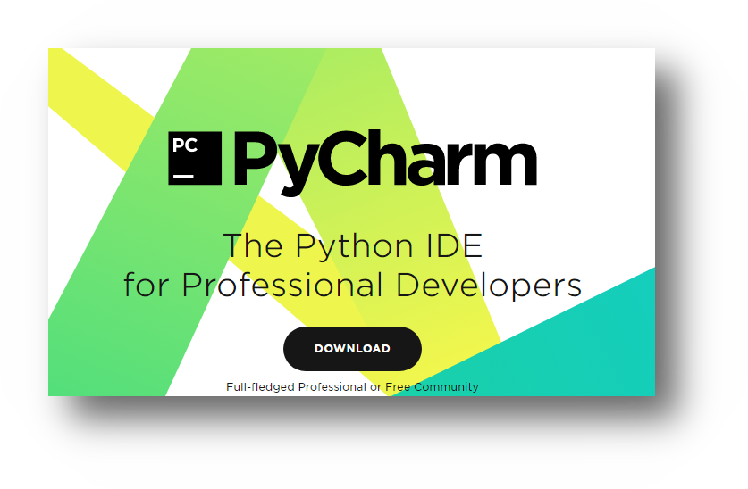

##### Korak 2.

Bitno je da izaberemo verziju **"Community"**, i nakon sto kliknemo 
na **"Download"** dobicemo opciju da sacuvamo instalacioni fajl.

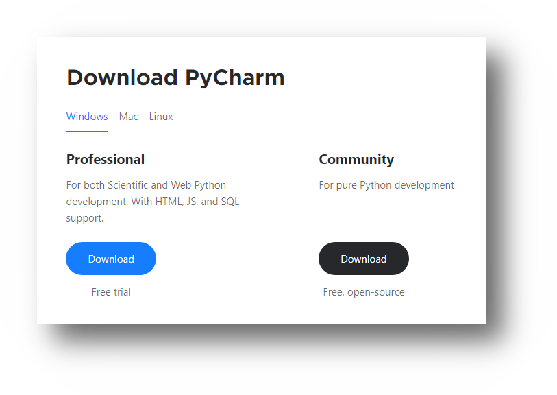

##### Korak 3.

Odaberemo lokaciju gdje zelimo sacuvati instalacioni fajl i sacuvamo ga
sa klikom na dugme **"Save"**

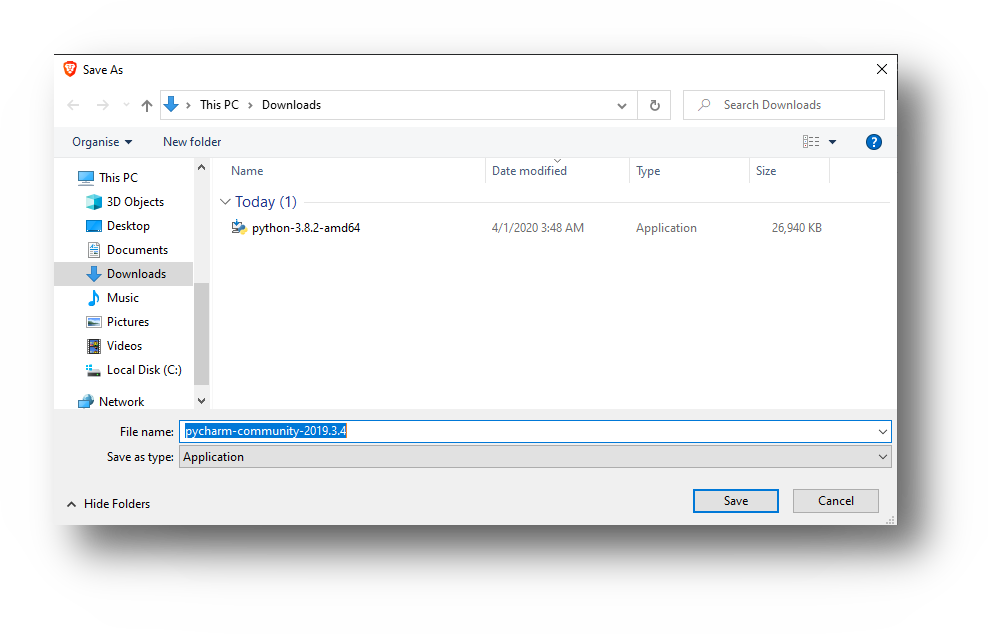

##### Korak 4.

Pokrenemo instalaciju PyCharm-a, klikom na skinuti fajl. Sada je potrebno 
kliknuti na dugme **"Next"**. 

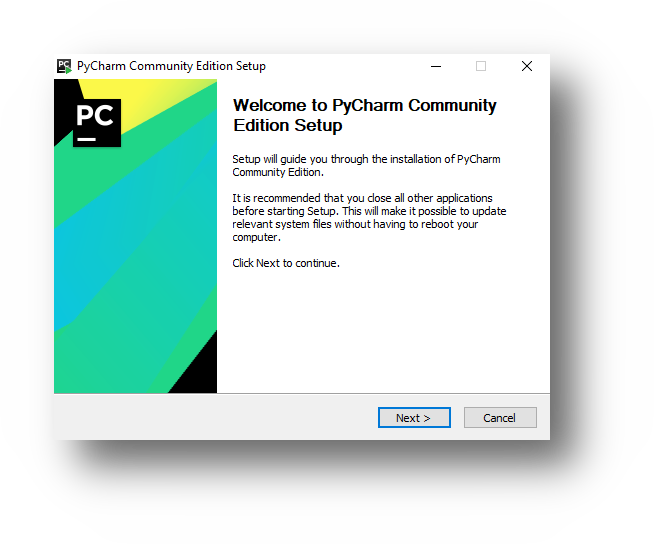

##### Korak 5.

Ponovo izaberite dugme **"Next"**. 

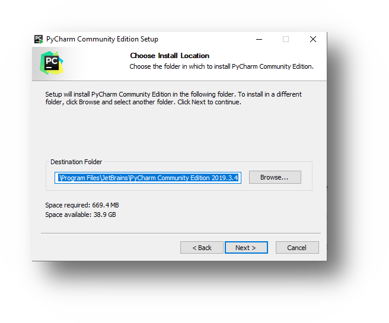

##### Korak 6.

U prozoru **"Installation Options"**, bitno je da cekirate sledece opcije
**"64-bit launcher"**, **"Add launchers dir to the PATH"**, **".py"**. 

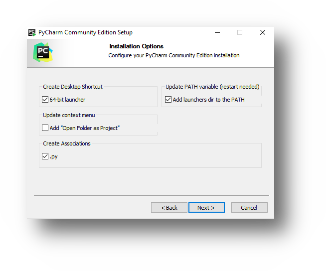

##### Korak 7.

U ovom koraku je bitno kliknuti na dugme **"Install"**.

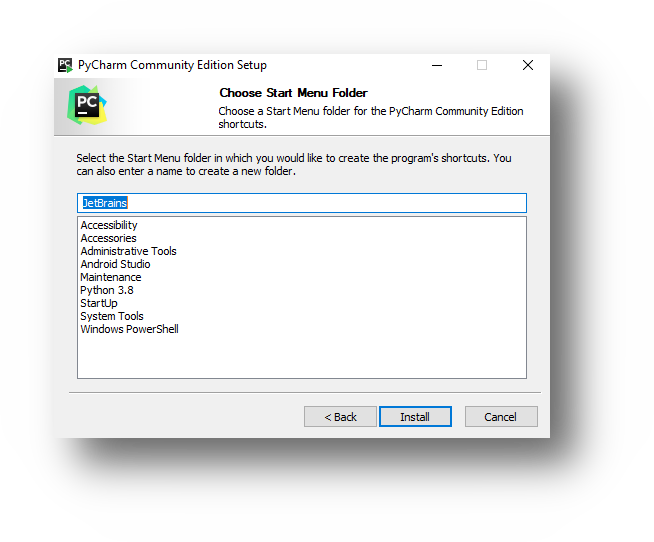

##### Korak 8.

Mozete kliknuti na dugme **"Finish"**. Nakon sto se sistem restartuje mozemo
krenuti sa osnovnim podesavanjem PyCharm radnog okruzenja.

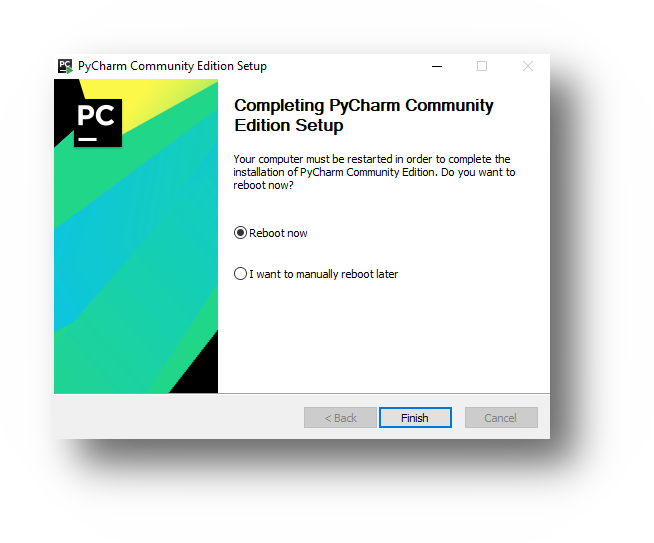

#### Podesavanje PyCharm-a i nas prvi program "Zdravo Svijete"

##### Korak 1.

Prilikom prvog ili inicijalnog pokretanja PyCharm programa potrebno je da 
izvrsimo osnovna podesavanja, kako bi prilagodili program za potrebe kursa i 
lakse pracenje. 
Na ovom koraku mozete ostaviti cekiranu opciju **"Do not import settings"** i
nastaviti dalje sa klikom na dugme **"OK"**.

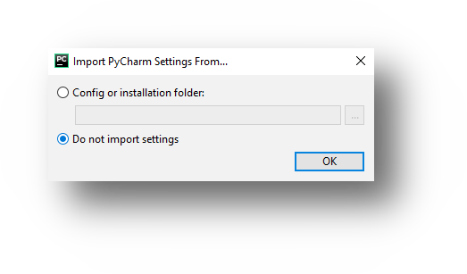

##### Korak 2.

U ovom koraku je potrebno cekirati polje 
**"I confirm that I have read and accept the terms of this User Agreement"**, 
cime se slazemo sa polisom koristenja ovog PyChar programa i naravno za dalje
kliknuti dugme **"Continue"**.

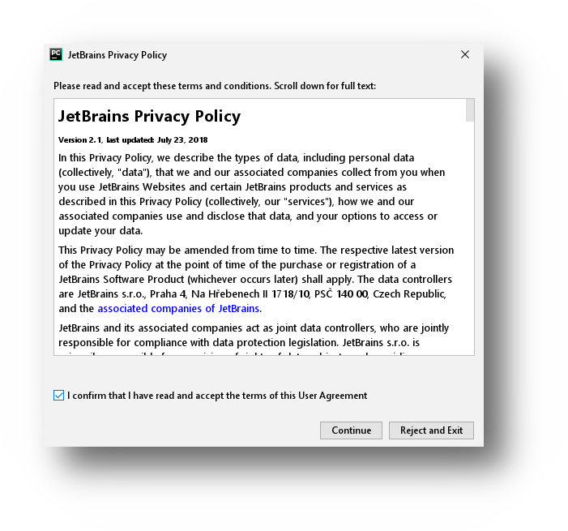

##### Korak 3.

Obzirom da ne zelimo slati nikakvu statistiku sa naseg kompjutera, ovde cemo
izabrati opciju **"Don't send".

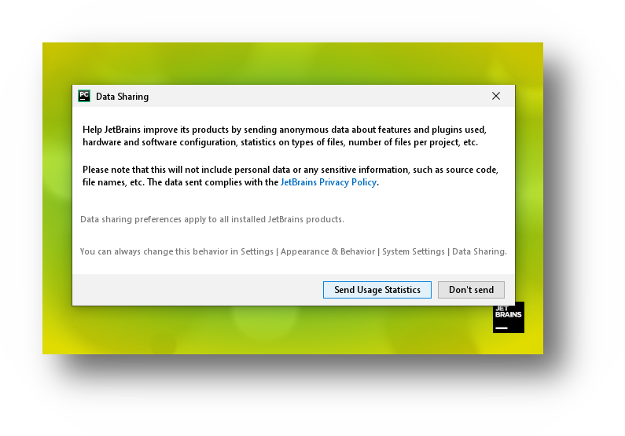

##### Korak 4.

Ovaj korak se odnosi na izbor teme, za potrebe kursa koristicemo **"Light"** 
temu, naravno vi mozete izabrati koja vam vise odgovara. Konacno mozemo 
kliknuti na dugme **"Skip Remaining and Set Defaults"**. 

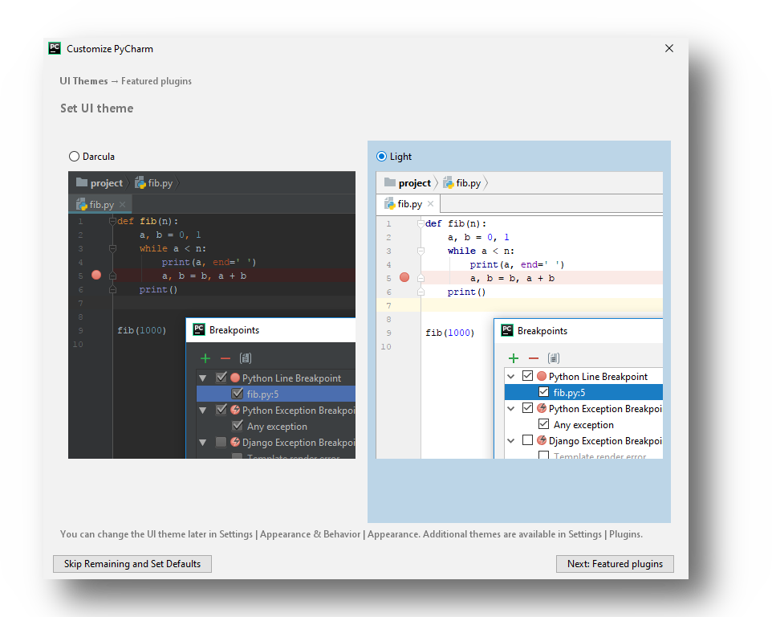

##### Korak 5.

U sledecem prozoru mozemo odabrati opciju **"Crate New Project"**, nakon 
cega moramo podesiti radno okruzenje za novi projekt. 

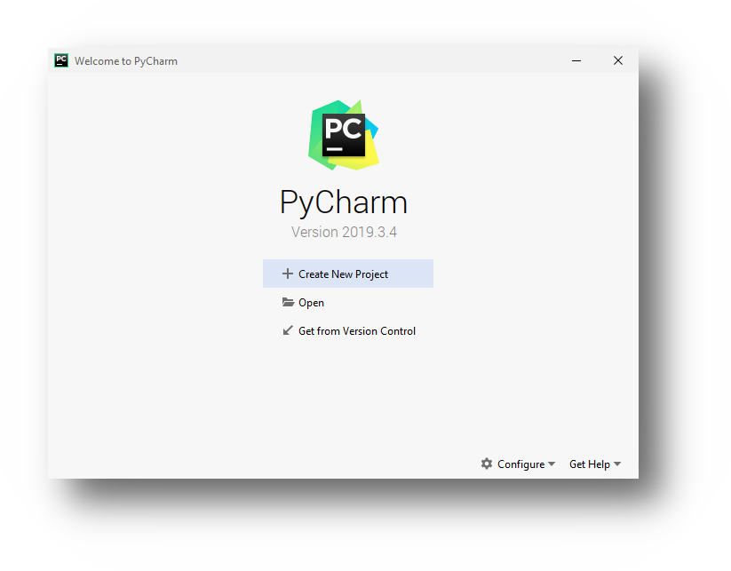

##### Korak 6.

Nazovimo projekt **"moj_novi_projekt"** i kliknimo na dugme **"Create"**.

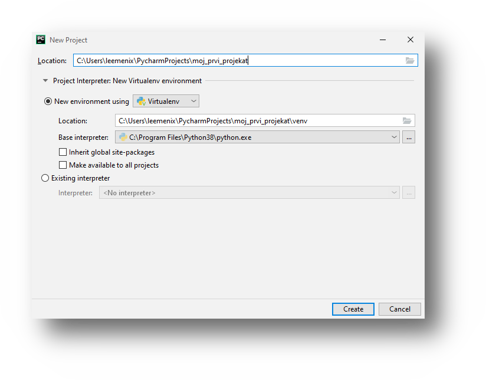

##### Korak 7.

Sada je potrebno sacekati kako bi se kreiralo virtuelno okruzenje za nas novi
projekat. 

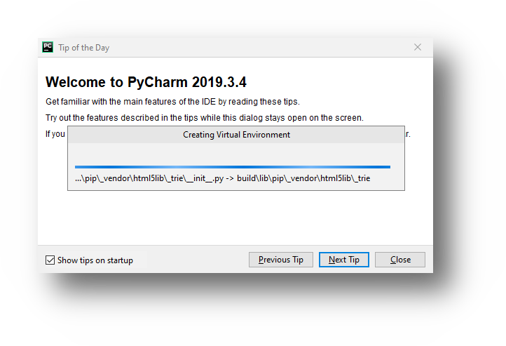

##### Korak 8.

Nakon sto se okruzenej kreiralo, opciono mozemo onemoguciti opciju 
**"Show tips on startup"** i kliknuti na dugme **"Close"**

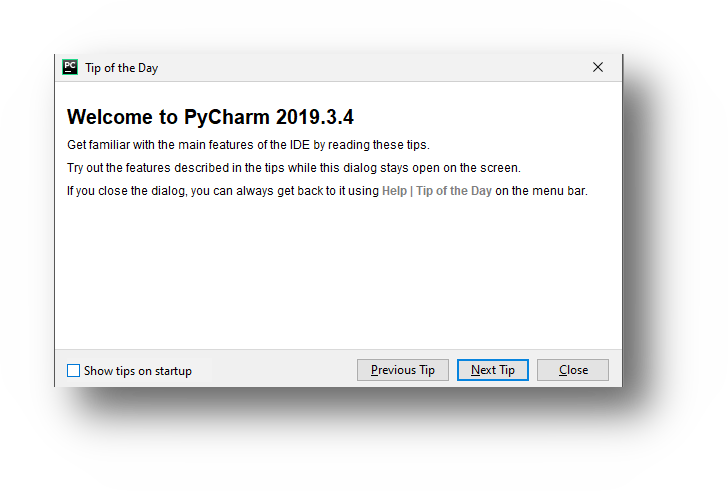

##### Korak 9.

Iz menija izaberite opciju **"File"**

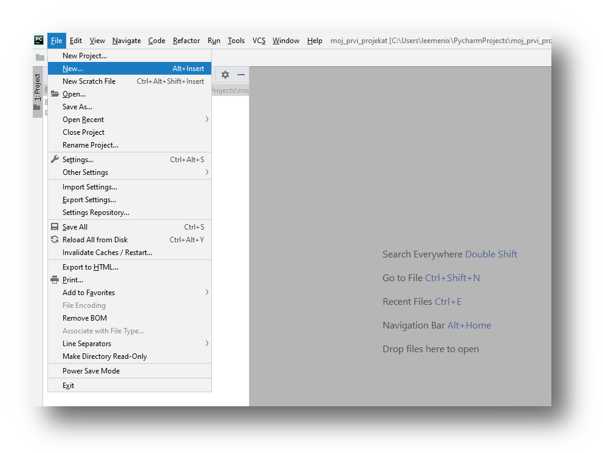

##### Korak 10.

zatim odaberite **"Python file"**

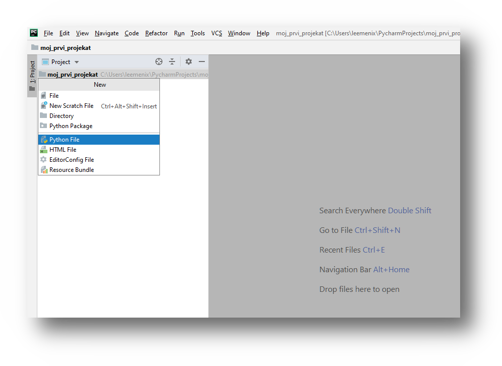

##### Korak 13.

a nakon toga dajte ime fajlu **"moj_prvi_program"** i kliknite **"Enter"**.
Ovime smo kreirali novi fajl moj_prvi_program.py (ekstenziju .py ce dodijeliti
sam PyCharm, na nama je samo da damo ime programu).
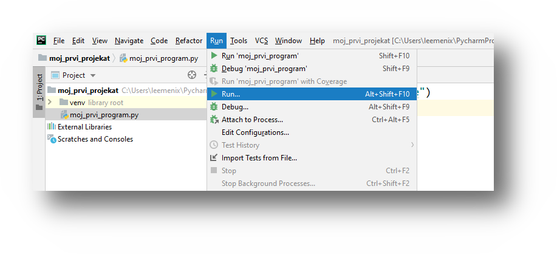

##### Korak 14.
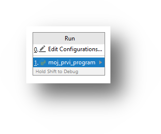

##### Korak 15.
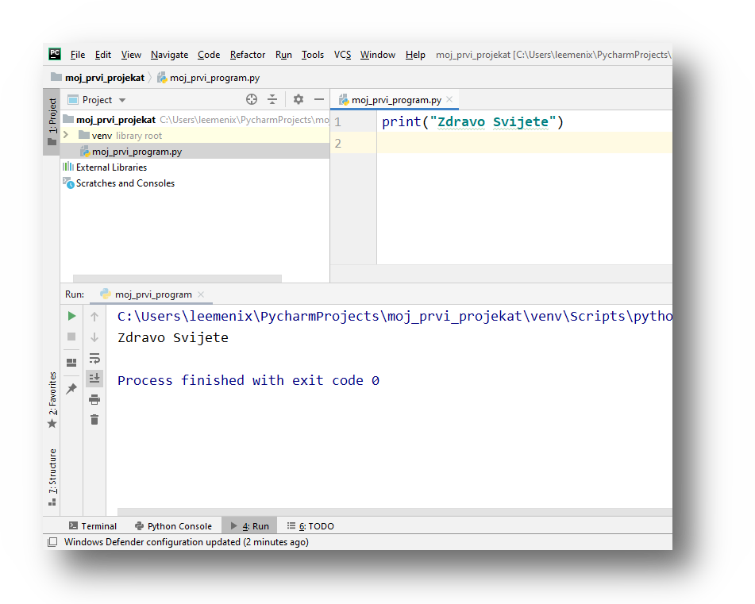

##### Korak 16.

  - promjena teme, odredisnog direktorija, velicine fonta i sl.
  - New -> Python File ...

  - Sublime installation, notpad ++
  - mi cemo koristiti PyCharm - IDE (Integrated Development Environment) 

- python 2 (legacy), python 3 (future)
  - razlika u sintaksi