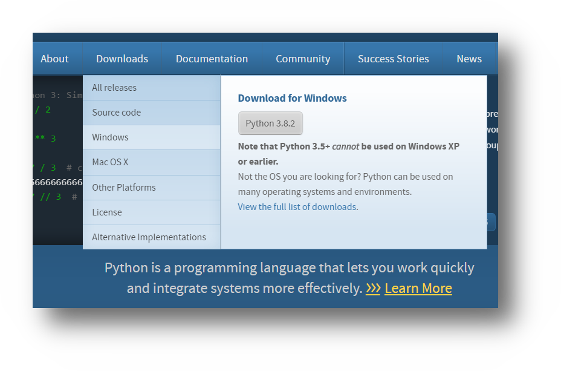
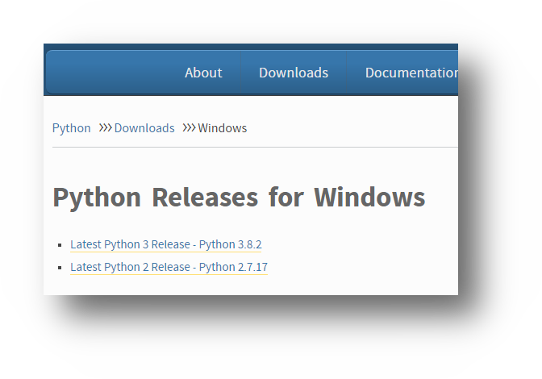
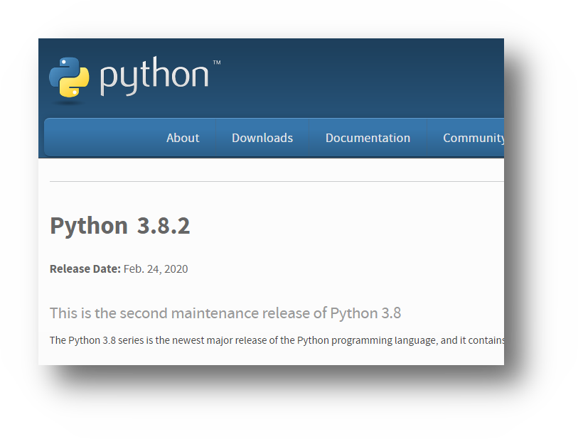
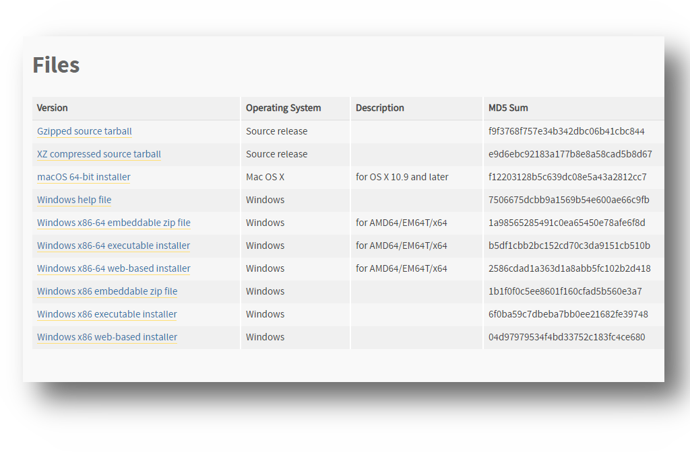
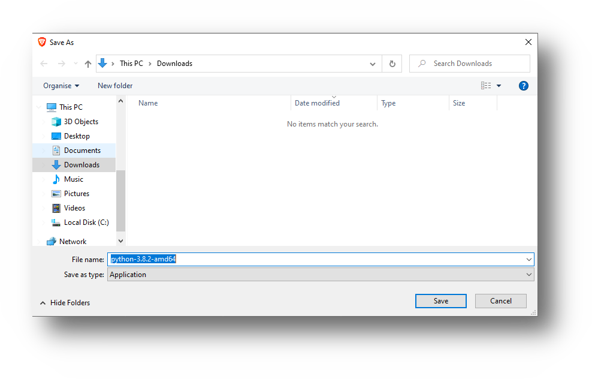
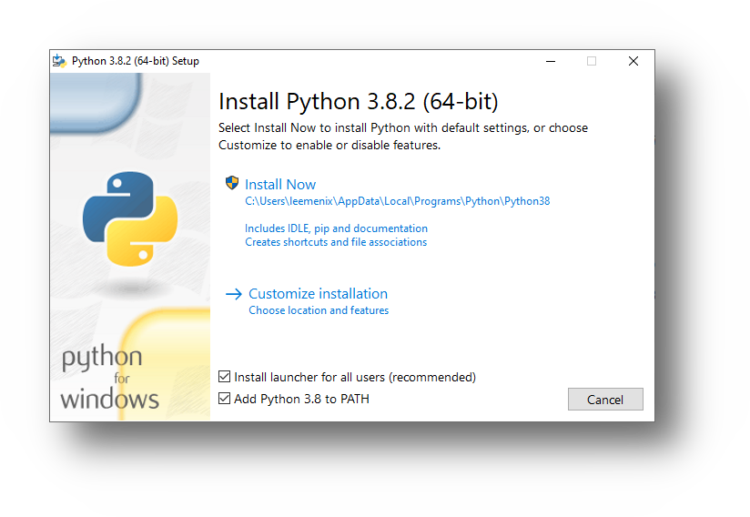
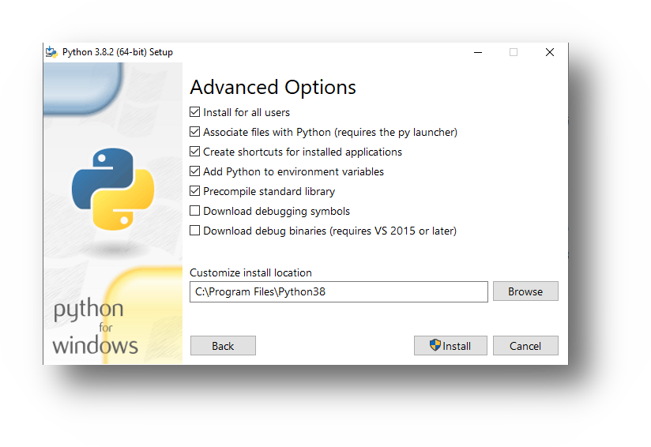
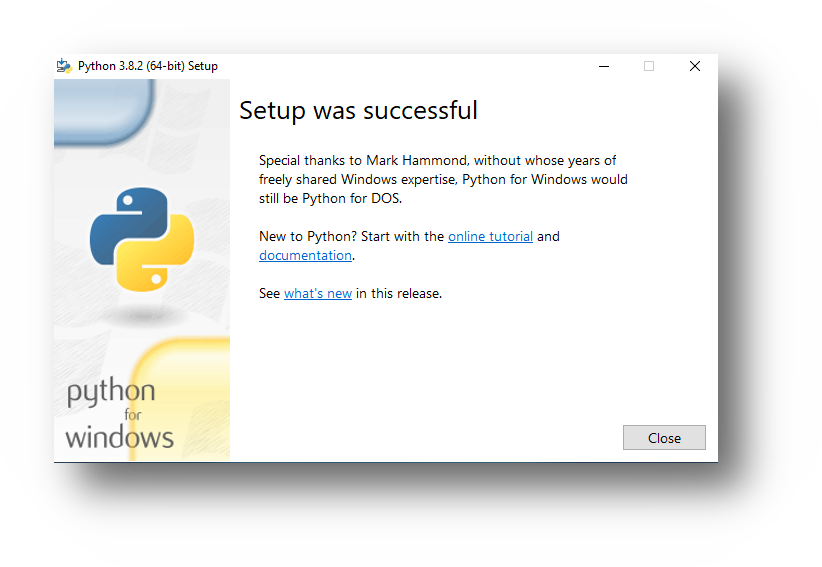
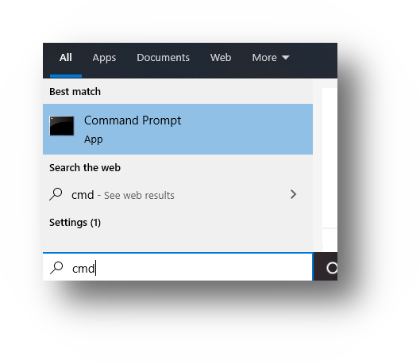
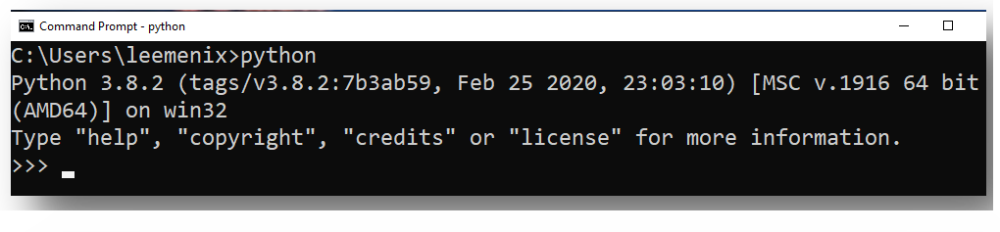

## Priprema radnog okruzenja

### Izbor editora teksta i **Integrisanog razvojnog okruzenja** IDE (Integrated Development Environment)

#### Izbor tekst editora

Za pocetnike, se preporucuje koristenje nekog jednostavnog tekst editora kao Notpad++, Sublime, VisualStudio Code ...

#### Izbor Interisanog razvojnog okruzenja

Vecina programera odabere pisanje Python koda, koristenjem specijalnog 
integrisanog razvojnog okruzenja. Trenutno tri najistaknutija za Python su 
Eclipse, PyCharm i Netbeans. Za potrebe kursa, koristicemo **PyCharm**.

#### Instalacija Windows

##### Korak 1.

Nakon sto otvoritmo stranicu https://python.org potrebno je da skinemo 
instalacijski paket za trenutnu aktuelnu verziju Python-a.

Za vrijeme pisanje kursa verzija Python-a je bila 3.8.2, sto se moze 
razlikovati u vasem slucaju ali princip instalacije je isti ili slican.

Iz padajuceg menija "Downloads" potrebno je izabrati opciju "Windows"

Prilikom pokretanja instalacije, na prvom koraku je potrebno cekirati obe opcije:
* Install launcher for all users (recommended)
* Add Python 3.x to PATH

- PyCharm installation (Win, Linux)

- Sublime installation, notpad ++
  - mi cemo koristiti PyCharm - IDE (Integrated Development Environment) 

- python 2 (legacy), python 3 (future)
  - razlika u sintaksi

- podesavanje PyCharm-a i nas prvi program
  - promjena teme, odredisnog direktorija, velicine fonta i sl.
  - New -> Python File ...