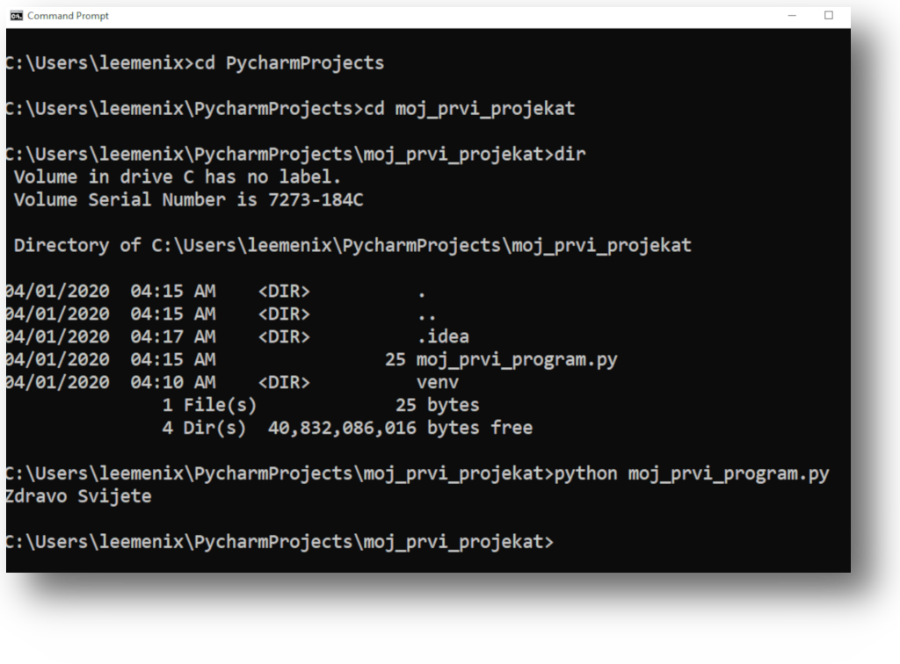

<div style="page-break-after: always;"></div>

## Zdravo Svijete

**`Izvorni kod: kod-10_zdravo-svijete.py`**

```python      
print("Zdravo Svijete!")
```

Imamo dva nacina za pokretanje Python programa:

1. U slucaju da nesto zelimo brzo provjeriti, recimo ispis jedne linije koda, 
sabiranje dva broja, pridruzivanje vrijednosti promjenjivoj koristicemo 
komandni prompt (command prompt) ili cmd (na Windows operativnom sistemu) ili
terminal (na Linux, FreeBSD ili MacOS operativnim sistemima)



2. U slucaju da nas program zahtijeva vise linija koda, kreiranje odredjenje 
logicke strukture, izvrsavanje uslova i petlji, kreiranje funkcija ili klasa 
potrebno je prvo sav kod zapisati kao datoteku, sto u programiranju zovemo
**Izvorni kod** i odatle ga izvrsiti pomocu python komande ili direktno iz 
IDE-a.


Programiranje u najjednostavnijoj svojoj reprezentaciji predstavlja davanje 
instrukcija kompjuteru (kroz programski jezik) i na osnovu ovih instrukcija 
kompjuter donosi odluke. Ucenje novog programski jezik se jednostavno moze 
uporediti i sa ucenjem bilo kog drugog stranog jezika, stim da je dosta 
jednostavnije, jer kad jednom shvatimo logiku programskog jezika ostalo je 
samo nadogradjivanje i nasa masta.


**`Izvorni kod: kod-11_crtanje-oblika.py`**

```python
print("*")
print("**")
print("***")
print("****")
print("*****")
print("******")
```

U prethodnom primjeru Python ide liniju po liniju i izvrsava kod. Sta se 
desava u slucaju da zamijenimo prvu i zadnju liniju?

## Komentarisanje koda

Komentare koristimo kada zelimo da zapisemo neki podsjetinik unutar koda, 
komentarisemo kod, objasnimo drugima i sebi sta odredjena linija koda radi. 
Praksa i preporuka je da se koristi simbol taraba (hash tag) **#**.
Komentari se po definiciji ignorisu u Python-u, preciznije ignorisani od 
strane Python interpretera, pa tako kad Python prilikom citanja koda naidje
na znak **#**, ignorise sve u toj liniji sto se nalazi iza znaka **#**.

**`Izvorni kod: kod-12_demonstracija-komentara.py`**
```python
'''
Viselinijski komentar
'''
"""
Viselinijski komentar
"""
print("Komentari su korisni")
# print("Ova linija koda nece biti ispisana")
```
